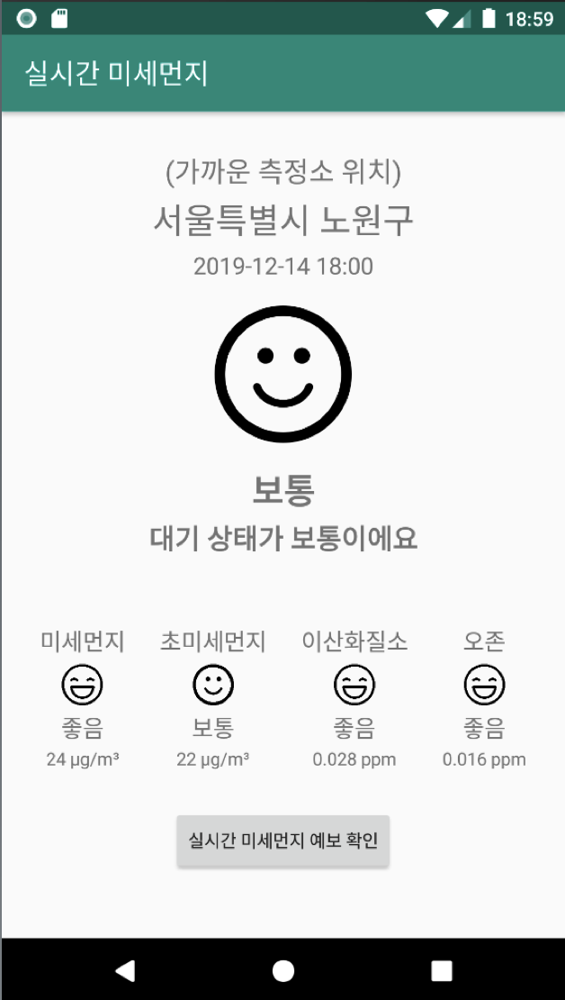
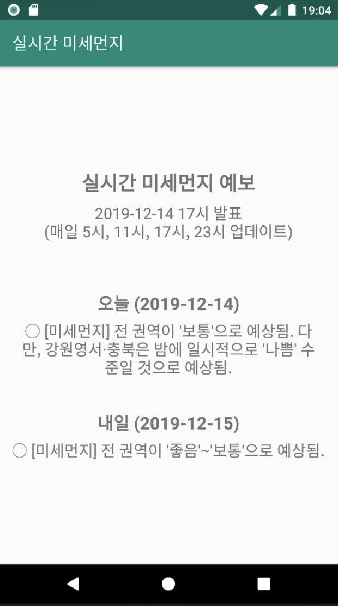

## Fine Dust Android App (미세먼지 어플)

&nbsp;&nbsp;&nbsp;&nbsp;&nbsp;&nbsp;&nbsp;&nbsp;&nbsp;&nbsp;&nbsp;&nbsp;&nbsp;&nbsp;&nbsp;&nbsp;&nbsp;&nbsp;&nbsp;&nbsp;&nbsp;&nbsp;&nbsp;&nbsp;&nbsp;&nbsp;&nbsp;&nbsp;&nbsp;&nbsp;&nbsp;&nbsp;&nbsp;&nbsp;&nbsp;&nbsp;&nbsp;&nbsp;&nbsp;&nbsp;&nbsp;&nbsp;&nbsp;&nbsp;&nbsp;&nbsp;&nbsp;&nbsp;&nbsp;&nbsp;&nbsp;&nbsp;&nbsp;&nbsp;&nbsp;&nbsp;&nbsp;&nbsp;&nbsp;&nbsp;*2019-2 모바일프로그래밍 프로젝트*

**현재 위치에 기반한 미세먼지 어플 구현**

**자세한 내용은 report.ppt 파일을 확인해주세요**

 

- **구현한 기능 소개**
  - 미세먼지, 초미세먼지 실시간 농도
  - 현재 사용자 위치에 기반한 대기 정보 제공
  - 현재 통합 대기에 따른 직관적인 표시
  - 미세먼지, 초미세먼지 시간 별 예보
  - 황사, 오존, 이산화질소 등 추가적인 정보

 

- **사용한 언어 및 도구, 라이브러리**
  + Java
  + 공공 데이터 포털 API (대기오염정보 조회 서비스, 측정소 정보 조회 서비스)
  + 좌표 변환 API

 

+ **개발 환경**
  + macOS Catalina
  + Android Studio

 

- **스크린샷**

  </img>
  
  
  
  </img>

---

> 2020.1.1 최종 업데이트
>
> 광운대학교 소프트웨어학부 윤홍찬

